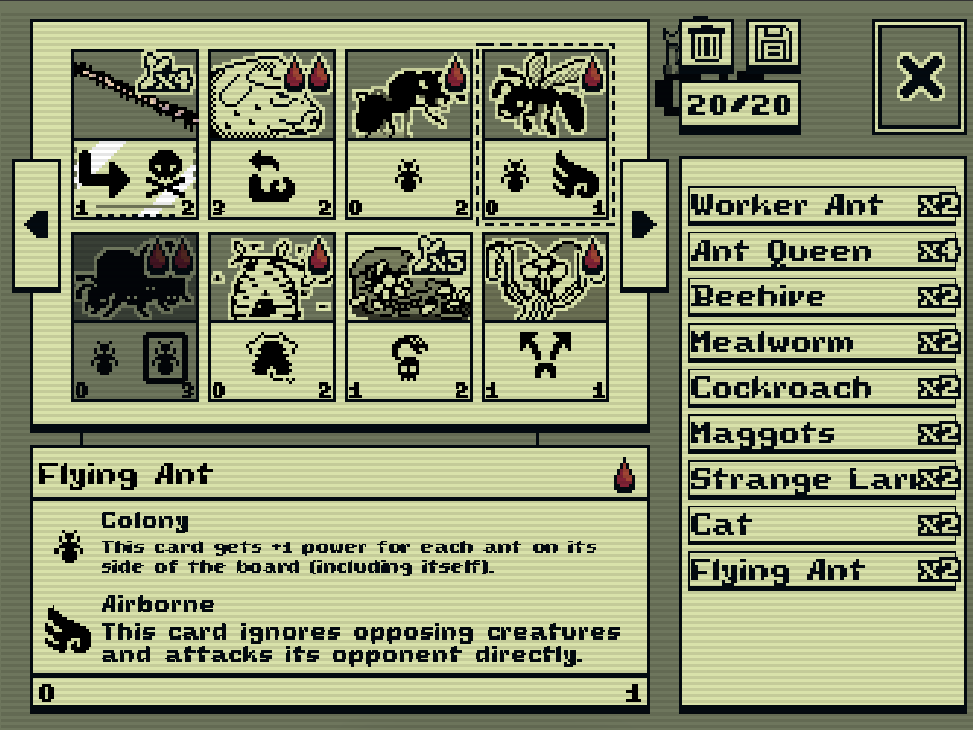

# Inscryption

This is a multiplayer version of [Inscryption](https://store.steampowered.com/app/1092790/Inscryption/). The majority of the assets used in this game are copyright of Daniel Mullens Games. This project is a fan-game and uses the assets for non-profit purposes.

# Playing the Game

The servers for this game are no longer running, but you are welcome to host the server
yourself. To run the server, run the following of the project:

```
godot --headless
```

This will open up a LAN-capable version of the server that desktop clients can connect
to. If you want the server to work offline, you'll need to make the following changes.

First, in the `server.cfg` file, you'll need to add the cas and privkey fields:

```
# server.cfg
version=0.9.3
cas=<cas>
privkey=<private key>
```

Then you'll need to configure the network code to use these fields. You can do this
by uncommenting the relevant lines near line 130 of `network.gd`. You'll also want
to delete the create_server() call on line 135 because you'll be replacing that
with your own call to create_server().

Lastly, you'll want to change the `SERVER_IP` at the top of `network.gd` so that 
any clients you build will know which server to connect to.

Note that this project was built with Godot v4.2.2 stable and may not work with future
versions.


