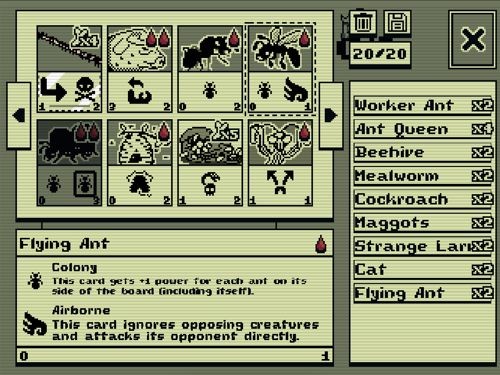

# Inscryption

This is a multiplayer version of [Inscryption](https://store.steampowered.com/app/1092790/Inscryption/). The majority of the assets used in this game are copyright of Daniel Mullens Games. This project is a fan-game and uses the assets for non-profit purposes.

You can play the game in-browser on [itch.io](https://matthewkayin.itch.io/inscryption), but only if the server is online.

The game is peer-to-peer, and I originally planned on doing a simple LAN direct-IP connection similar to something like Warcraft 2's multiplayer, but I wanted the game to be playable in browser, which meant LAN was off the table. Instead I setup dedicated Secure WebSocket server to act as the lobby. Players enter the lobby by connecting to the server, then they communicate with each other in a peer-to-peer fashion once they've entered a match.

